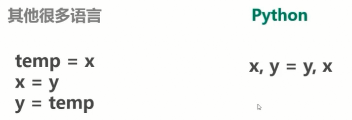

# 概述

* [Python](https://www.python.org/)并不是一门新兴的语言，而是诞生于上世界90年代初，近年来随着大数据与人工智能的流行，Python逐步的流行了起来，Python像一个技术的润滑剂，大多数互联网公司或多或少都会用到

* 根据TIOBE语言排行，Python高居第四，已超越C#，仅次于Java、C和C++

## Python的特点

* Python是一门编程语言，它只是众多编程语言中的一种

* 语法简洁、优雅、编写的程序容易阅读，Pythonic风格的代码，比如交换两个变量

    

* 跨平台，可以运行在Windows、Linux以及Macos

* 易于学习，站在非计算机专业的角度来讲，如果把编程语言当做解决向题的工具， Python确实相较于C++、Java、Javascripts等语言要易于学习和掌握

* 极为强大而丰富的标准库与第三方库，比如电子邮件，比如图形GU界面

* Python是面向对象的语言

## Python的缺点

* 相较于C、C++、Java，运行效率较慢

    * 编译型语言(C、C++)、解释型语言(Javascript、Python)

* 运行效率与开发效率，鱼与熊掌不可兼得

## Python的作用

* 爬虫

* 大数据与技术分析(Spark)

* 自动化运维与自动化测试

* Web开发：Flask、Django

* 机器学习：Tensor Flow

* 胶水语言：混合其他如C++、Java等来编程，能够把用其他语言制作的各种模块(尤其是C/C++)很轻松地联结在一起

## 开发环境搭建

* Python安装包[下载地址](https://www.python.org/)

* Python[官方文档](https://docs.python.org/zh-cn/3.8/index.html)

