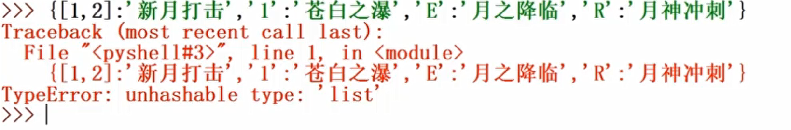

# 基本语法

## 数字

### 整型&浮点型

* Number：数字，一个大的分类，他的下面还有如下分类

    * 整数 int，其他语言：short、int、long，在python中只有int一种类型

    * 浮点数 float，其他语言：单精度(foat)、双精度( double)，在python中没有单精度和双精度之分，只有一种浮点数的类型，因为在python中浮点数支持的精度就和其他语言的双精度一样

    

    * 单斜杠是除法，但是他会自动的将参与运算的数字转换为浮点数，然后在进行运算

    * 双斜杠可以理解为整除，只会保留整数部分

### 进制表示

* 二进制：要在数字前面加上`0b`，如`0b10`

* 八进制：要在数字前面加上`0o`，如`0o10`

* 十六进制：要在数字前面加上`0x`，如`0x10`

* 其他的进制转换为二进制

    ```python
    >>> bin(100)
    0b1010
    >>> bin(0o7)
    0b111
    >>> bin(0xE)
    0b1110
    ```

* 其他的进制转换为十进制

    ```python
    >>> bin(0b111)
    7
    >>> bin(0o77)
    63
    ```

* 其他的进制转换为十六进制

    ```python
    >>> hex(888)
    0x378
    >>> bin(0o7777)
    0xfff
    ```

* 其他的进制转换为八进制

    ```python
    >>> oct(0b111)
    0o7
    >>> bin(0x777)
    0o3567
    ```

### 布尔类型&复数

* 布尔类型：表示真、假，布尔类型是属于Number数字大分类下面的一种子类型

    
    
    

* complex 复数

## 组

* 示意图

    

### 序列

#### 字符串:单引号&双引号

* 在python中可以使用单引号、双引号、三引号表示字符串

    
    

* 多行字符串

    
    
    

##### 转义字符

* 特殊的字符

    * 无法'看见'的字符

    
    
    
    * 与语言本身语法有冲突的字符

##### 原始字符串

* 字符串原样输出，不处理转义字符

    

##### 字符串运算

* 字符串简单运算

    
    
    
    

#### 列表

* 列表创建

    

* 列表基本操作

    
    

#### 元组

* 元组定义

    
    
    

#### 序列操作

* 序列常用操作

    
    
    
    
    

### 集合

#### 集合定义

* 集合Set是无序的，并且元素不重复

    

#### 集合操作

* 集合常用操作

    
    

### 字典

#### 字典定义

* 字典的定义

    
    
    

## 变量

* 变量定义

    

* 变量命名规则

    * 变量名只能使用字母、数字、下划线，其中首字符不能是数字

    * python关键字也不能作为变量名

    * 变量名区分大小写

    
