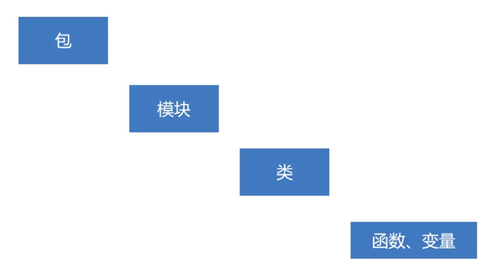

# 模块化

## 项目组织结构

* python项目的组织结构

    

    * 可以把包简单的理解为一个文件夹
    
    * 如果把包理解为文件夹的话，那么模块就是一个一个的文件，这些文件都存在这个包下面

    * 在模块下面写的最多的应该是类，类的下面还有函数和变量

    * 一个包下面是可以包含很多个模块的，而一个模块下面也是可以包含很多个类的

    * 一个模块在物理上面看到的就是一个`.py`文件，在一个模块下面也就是一个py文件中是可以写多个类的

    * 模块下也不是只可以写类，也可以写函数和变量，甚至是业务逻辑代码

## 包

* 表面上看，包的名字就是文件夹的名字，一个包下面是包含很多模块的，一个包下面还可以有子包

* 包在物理表现上面是一个文件夹，但是一个文件夹并不等同于一个包，如果想让一个文件夹成为一个包的话，必须在这个文件夹下面有一个特定的文件，这个文件就是`__init__.py`文件，如果没有这个文件，python就认为这是一个普通的文件夹而不是一个包

* `__init__.py`这个特殊的文件本身也是一个模块，在这个文件里面可以什么都不写，只是用它来标注一个包，也可以在这个文件里面和其他的模块一样编写一些代码

## 模块

### 模块命名

* 文件的名字就是模块的名字

* 如果要区分不同包的同名的模块的话，需要在这个模块的名字前面加上包的名字

* 对于一个模块来讲，他的名字就是包名加上文件名，对于这个特殊的`__init__.py`文件，他的名字就是他所在包的名字

### 模块导入

* 导入模块的语法主要有两个

    * 使用`import`关键字导入模块，`import`只能导入模块，不能直接导入模块下面的变量

    ```python
    import utils.c1 as c1
    print(c1.A)
    ```

    * 使用`from module import 变量,函数...`方式导入具体的模块成员

    ```python
    from utils.c1 import A,B,C
    print(A)
    print(B)
    print(C)
    ```

    ```python
    from utils import c1
    print(c1.A)
    ```

* 通过`__all__`决定哪些模块成员可以被导出

    ```python
    A = 10
    B = 20
    C = 30
    __all__ = ["A", "B"]
    ```

    ```python
    from utils.c1 import *
    print(A)
    print(B)
    ```

### __init__.py用法

* 最基本的作用就是当一个包被导入的时候，这个init文件将首先被执行，而且是被python自动的执行，不需要手动调用执行

* 在真实的项目里面，我们可以在这个文件里面做一些模块的初始化工作，这是init文件的主要应用场景

* 在init文件里面，可以通过`__all__`决定哪些模块可以被导出

* init文件另一个作用就是我们可以利用他来做包内部模块的批量导入

### 常见问题

* 包和模块是不会被重复导入的，比如C12和C13同时都导入了C8这个模块，但是C8模块导入的过程只会执行一次，不会执行两次，当导入一个模块的时候，python就会执行导入模块的代码，但是无论在应用程序里面导入多少次，该导入模块的代码只会执行一次

* 避免循环导入

## 函数

### 函数定义

* 函数定义

    ```python
    def funcname(parameter_list):
        pass
    ```

    * 参数列表可以没有

    * 可以在函数体中使用return返回函数结果，如果函数体里面没有return语句的话，python认为函数返回None这样的一个空值

### 函数返回值

* python中的函数可以一次返回多个值

    ```python
    def damage(skill1, skill2):
        damage1 = 1
        damage2 = 2
        return damage1, damage2

    skill1_damage, skill2_damage = damage(3, 6)
    print(skill1_damage, skill2_damage)
    ```

### 序列解包

* 序列解包

    ```python
    a=1
    b=2
    c=3

    a,b,c = 1,2,3

    d = 1,2,3
    a,b,c = d
    ```

### 函数参数

* 必须参数

    ```python
    def add(x,y):
        pass
    ```

* 关键字参数

    ```python
    def add(x,y):
        pass
    add(y=3,x=2)
    ```

* 默认参数

    ```python
    def add(x=1,y=2):
        pass
    add()
    ```