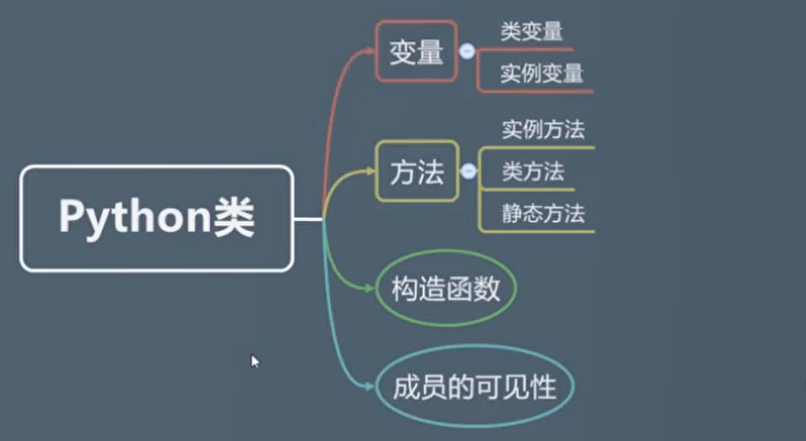
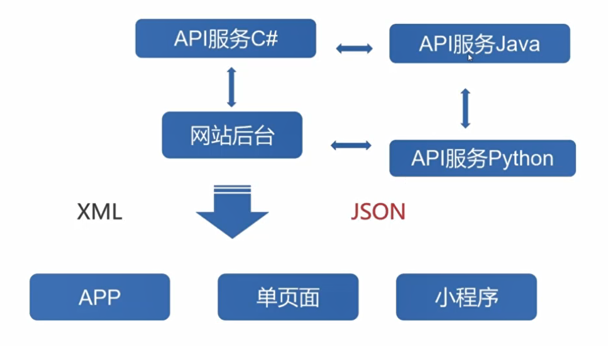

# 面向对象

## 类

* 结构图

    

### 类的定义

* 类的定义

    ```python
    class Student():
        name = ''
        age = 10

        def print_file(self):
            print(self.name)
            print(self.age)
    ```

* 类的实例化

    ```python
    student = Student()
    student.print_file()
    ```

### 类与对象

* 类和对象的关系就是通过实例化来关联在一起的

    ```python
    student = Student()
    student.print_file()
    ```

* 类是现实世界或思维世界中的实体在计算机中的反映，它将`数据`以及这些数据上的`操作`封装在一起

### 构造函数

* 构造函数

    ```python
    class Student():
        name = ''
        age = 0

        def __init__(self):
            print("student")
        def do_homework(self):
            print("homework")

    student1 = Student()# 构造函数的调用是自动进行的，当实例化的时候，python自动调用构造函数
    student1.__init__()# 可以主动的显式调用__init__方法，调用之后返回值为None，此时这个方法和普通方法一样，在实际编程中，很少这样做
    ```

    * 对于构造函数来说，是不能返回除None之外的任何类型的类型值的，只能返回None

* 示例代码

    ```python
    class Student():
        name = ''
        age = 0

        def __init__(self， name， age):
            self.name = name
            self.age = age

        def do_homework(self):
            print("homework")


    student1 = Student("li"， 12)
    print(student1.name)
    ```

### 成员变量

* 模块全局变量、模块局部变量

    ```python
    c = 50

    def add(x， y):
        c = x + y# 新定义的c变量，和全局变量c不是同一个变量，这个c的作用域仅仅局限在函数的内部，全局变量的值不会因为局部变量而更改
        print(c)

    add(1， 2)
    print(c)

    # 3
    # 50
    ```

    * 可以很明显的看到，如果函数定义了一个和全局变量同名的变量的话，局部的变量并不会覆盖全局的变量

* 类变量、实例变量

    * 类变量：和类相关的变量，和类关联到一起，类的内部方法之外的变量是类变量，不是实例变量

    * 实例变量：和对象相关联在一起的，实例变量的定义方法：就是使用self这样的关键字再加上变量的名字

    ```python
    class Student():
        # 类变量
        name = 'qiyue'
        age = 0

        def __init__(self， name， age):
            # 实例变量，只和实例相关，和类没有关系
            self.name = name
            self.age = age

        def do_homework(self):
            print("homework")

    student1 = Student("li"， 12)
    student2 = Student("zhou"，13)
    print(student1.name)
    print(student2.name)
    print(Student.name)
    ```

* 类变量、实例变量查找顺序

    ```python
    class Student():
        # 类变量
        name = 'qiyue'
        age = 0

        def __init__(self， name， age):
            # 实例变量，只和实例相关，和类没有关系
            name = name
            age = age

        def do_homework(self):
            print("homework")

    student1 = Student("li"， 12)
    print(student1.__dict__) # {}
    print(studnet1.name) # qiyue
    print(Student.name) # qiyue
    print(Student.__dict__)
    ```

    * 如果我们尝试去访问一个对象实例的实例变量的话，那么python会首先在对象的实例变量列表里面去查找有没有这样的变量，如果没有的话，python并不会返回一个空，他会继续到类变量列表里面去寻找该变量，这也就是为什么当访问student1下面的name实例变量的时候，他不存在，但是返回类变量值得原因，因为python会继续到类变量里面去寻找，他找到同名的name变量，将他返回回来，如果在类里面还没有找到，他会到Studen的父类里面去寻找

### self

* self就是当前调用某个实例方法的实例对象

* 如果要在类下面定义一个实例方法的话，那么必须在这个方法的参数列表的第一个位置固定放置一个self，也就是说对于类下面的实例方法默认会有一个python所规定的参数，他和我们自定义的参数是不同的

* 当我们调用实例方法的时候，不需要手动的传入self参数，这个参数是python默认为我们传入的参数

* self可以修改成任意需要的名字，但是位置必须是在实例方法参数列表的第一个位置

### 实例方法

* 实例方法也是和对象实例相关联的，也就是实例可以调用的方法，实例方法最大的特点就是他的第一个参数是需要传递一个self的

* 构造函数可以看做是一个特殊的实例方法，他和普通实例方法的区别只是调用方式不同而已，其他的特性和普通的实例方法一样，另外构造函数和实例方法的意义也不一样，实例方法主要用来描述对象实例的行为，而构造函数意义在与初始化类的各种数据特征的

* 实例方法访问类变量

    * 不要妄图在实例方法内部不通过self来访问实例变量，也不要想着不加任何的前缀来访问类变量，在实例方法内部可以通过类名加类变量的方式访问类的类变量

    ```python
    class Student():
        # 类变量
        sum = 0

        def __init__(self， name， age):
            # 实例变量，只和实例相关，和类没有关系
            self.name = name
            self.age = age
            print(Student.sum)
            print(self.__class__.sum) # 同上句

        def do_homework(self):
            print("homework")

    student1 = Student("li"， 12)
    ```

    ```python
    class Student():
        # 类变量
        sum = 0

        def __init__(self， name， age):
            # 实例变量，只和实例相关，和类没有关系
            self.name = name
            self.age = age
            # 访问类变量
            self.__class__.sum += 1

        def do_homework(self):
            print("homework")


    student1 = Student("li"， 12)
    student2 = Student("li"， 12)
    print(Student.sum)
    ```

### 类方法

* 类方法定义

    * 类方法和实例方法一样，他的参数列表第一个参数也有一个固定的参数

    * 决定一个方法是类方法还是实例方法，根本方式是看在这个方法上面是不是有装饰器`@classmethod`，而不是看参数列表第一个参数的名字

    * 类方法的主要作用是用来操作和类相关的一些变量

    ```python
    class Student():
        # 类变量
        sum = 0

        def __init__(self， name， age):
            # 实例变量，只和实例相关，和类没有关系
            self.name = name
            self.age = age

        def do_homework(self):
            print("homework")

        # 类方法
        @classmethod
        def plus_sum(cls):
            # 访问类变量
            cls.sum += 1
            print(cls.sum)


    student1 = Student("li"， 12)
    Student.plus_sum()
    student2 = Student("li"， 12)
    Student.plus_sum()
    ```

### 静态方法

* 静态方法的上面也要有一个装饰器`@staticmethod`

* 静态方法没有像类方法和实例方法一样必须要传递一个固定参数，他的参数列表可以为空，什么都不传递

* 实例对象和类都可以调用静态方法

* 静态方法内部也是可以访问类变量的

* 静态方法和类方法内部无法访问实例变量

* 建议静态方法不要经常使用，能用静态方法的地方都可以用类方法替换，而且使用类方法更加方便

    ```python
    class Student():
        # 类变量
        sum = 0

        def __init__(self， name， age):
            # 实例变量，只和实例相关，和类没有关系
            self.name = name
            self.age = age

        def do_homework(self):
            print("homework")

        # 类方法
        @classmethod
        def plus_sum(cls):
            cls.sum += 1
            print(cls.sum)

        @staticmethod
        def add(x， y):
            print("this is a static method")


    student1 = Student("li"， 12)
    student1.add(1， 2)
    Student.add(3， 4)
    ```

### 成员可见性

* 阻止其他人从类的外部直接对实例的实例变量进行修改赋值以及读取操作

    * 公开的 public，如果成员是公开的，那么我们就可以在类的外部来直接访问
    
    * 私有的 private，如果成员是私有的，那么我们在类的外部是无法直接进行读取和赋值操作的

    * 成员的名字以两个下划线开头，python就认为该成员是私有的，反之，都是公开的，如果后面再加上两个下划线，就和构造函数一样了，外部也是可以访问的，就不再是私有的了，一般而言，前后都加上下划线的成员都是python内置的成员，我们自己的代码只要前面加双下划线即可

    ```python
    class Student():
        # 类变量
        sum = 0

        def __init__(self， name， age):
            # 实例变量，只和实例相关，和类没有关系
            self.name = name
            self.age = age
            self.__score = 0

        def marking(self， score):
            self.__score = score
            print(self.name + "的成绩是" + str(self.score))

        def do_homework(self):
            print("homework")

        # 类方法
        @classmethod
        def plus_sum(cls):
            cls.sum += 1
            print(cls.sum)


    student1 = Student("li"， 12)
    print(student1.__score)#访问不到该成员
    student1.marking(12)
    ```

* 没有什么是不能访问的

    ```python
    class Student():
        # 类变量
        sum = 0

        def __init__(self， name， age):
            # 实例变量，只和实例相关，和类没有关系
            self.name = name
            self.age = age
            self.__score = 0

        def marking(self， score):
            self.__score = score
            print(self.name + "的成绩是" + str(self.__score))

        def do_homework(self):
            print("homework")

        # 类方法
        @classmethod
        def plus_sum(cls):
            cls.sum += 1
            print(cls.sum)


    student1 = Student("li"， 12)
    student1.marking(10)
    student1.__score = -1#这里实际上是给实例对象新增了一个__score属性
    print(student1.__score)#-1
    print(student1.__dict__)#{'name': 'li'， 'age': 12， '_Student__score': 10， '__score': -1}
    ```

    * 所以动态的添加私有变量是不可以的，python对私有变量的保护只是将私有变量的名字进行了修改，严格意义上来讲，python是没有私有变量的

## 继承

### 继承定义

* 继承性最基本的作用就是避免定义重复的方法和重复的变量

* 虽然python是可以在一个模块下面写多个类的定义的，但是建议还是一个模块写一个类

    ```python
    class Human:
        sum = 0

        def __init__(self， name， age):
            self.name = name
            self.age = age

        def get_name(self):
            return self.name

    class Student(Human):
        def do_homework(self):
            print("homework")

    student1 = Student('li'， 12)# 构造函数继承自父类构造函数，父类构造函数要求传入两个参数
    print(student1.name) # li
    print(student1.age) # 12
    print(Student.sum) # 0
    ```

### super关键字

* 子类方法中调用父类方法

    ```python
    class Human:
        sum = 0

        def __init__(self， name， age):
            self.name = name
            self.age = age

        def get_name(self):
            print(self.name)

    class Student(Human):
        def __init__(self， school， name， age):
            super().__init__(name， age)  # 调用父类的构造函数
            # Human.__init__(self，name，age) # 通过类调用实例方法，需要传递实例对象
            self.school = school

        def do_homework(self):
            print("homework")

    student1 = Student('school'， 'li'， 12)
    print(student1.name)
    print(student1.age)
    print(Student.sum)
    student1.get_name()
    print(student1.school)
    ```

    ```python
    class Human:
        sum = 0

        def __init__(self， name， age):
            self.name = name
            self.age = age

        def get_name(self):
            print(self.name)

        def do_homework(self):
            print("human homework")


    class Student(Human):
        def __init__(self， school， name， age):
            super().__init__(name， age)  # 调用父类的构造函数
            # Human.__init__(self，name，age)
            self.school = school

        def do_homework(self):
            super().do_homework()
            print("student homework")


    student1 = Student("school"， 'li'， 12)
    print(student1.name)
    print(student1.age)
    print(Student.sum)
    student1.get_name()
    print(student1.school)
    student1.do_homework()
    ```

## 正则表达式

* 正则表达式是一个特殊的字符序列，用于检测一个字符串是否与我们所设定的这样的字符序列相匹配，正则表达式主要用于快速检索文本、实现一些替换文本的操作

    * 检查一串数字是否是电话号码
    
    * 检测一个字符串是否符合email
    
    * 把一个文本里指定的单词替换为另外一个单词

### 元字符&普通字符

* 正则表达式就是由普通字符和元字符组成的

    * 普通字符通常用来进行定界的，可以帮助我们在一个很长的字符串里面确定某一小段字符串

    ```python
    import re

    sample = "abc,acc,adc,aec,afc,ahc"
    result = re.findall("a[cf]c", sample)
    print(result)
    ```

    * 元字符

    | 字符         | 描述                                                         |
    | :----------- | :----------------------------------------------------------- |
    | \            | 将下一个字符标记为一个特殊字符、或一个原义字符、或一个 向后引用、或一个八进制转义符。例如，'n' 匹配字符 "n"。'\n' 匹配一个换行符。序列 '\\' 匹配 "\" 而 "\(" 则匹配 "("。 |
    | ^            | 匹配输入字符串的开始位置。如果设置了 RegExp 对象的 Multiline 属性，^ 也匹配 '\n' 或 '\r' 之后的位置。 |
    | $            | 匹配输入字符串的结束位置。如果设置了RegExp 对象的 Multiline 属性，$ 也匹配 '\n' 或 '\r' 之前的位置。 |
    | *            | 匹配前面的子表达式零次或多次。例如，zo* 能匹配 "z" 以及 "zoo"。* 等价于{0,}。 |
    | +            | 匹配前面的子表达式一次或多次。例如，'zo+' 能匹配 "zo" 以及 "zoo"，但不能匹配 "z"。+ 等价于 {1,}。 |
    | ?            | 匹配前面的子表达式零次或一次。例如，"do(es)?" 可以匹配 "do" 或 "does" 。? 等价于 {0,1}。 |
    | {n}          | n 是一个非负整数。匹配确定的 n 次。例如，'o{2}' 不能匹配 "Bob" 中的 'o'，但是能匹配 "food" 中的两个 o。 |
    | {n,}         | n 是一个非负整数。至少匹配n 次。例如，'o{2,}' 不能匹配 "Bob" 中的 'o'，但能匹配 "foooood" 中的所有 o。'o{1,}' 等价于 'o+'。'o{0,}' 则等价于 'o*'。 |
    | {n,m}        | m 和 n 均为非负整数，其中n <= m。最少匹配 n 次且最多匹配 m 次。例如，"o{1,3}" 将匹配 "fooooood" 中的前三个 o。'o{0,1}' 等价于 'o?'。请注意在逗号和两个数之间不能有空格。 |
    | ?            | 当该字符紧跟在任何一个其他限制符 (*, +, ?, {n}, {n,}, {n,m}) 后面时，匹配模式是非贪婪的。非贪婪模式尽可能少的匹配所搜索的字符串，而默认的贪婪模式则尽可能多的匹配所搜索的字符串。例如，对于字符串 "oooo"，'o+?' 将匹配单个 "o"，而 'o+' 将匹配所有 'o'。 |
    | .            | 匹配除换行符（\n、\r）之外的任何单个字符。要匹配包括 '\n' 在内的任何字符，请使用像"**(.\|\n)**"的模式。 |
    | (pattern)    | 匹配 pattern 并获取这一匹配。所获取的匹配可以从产生的 Matches 集合得到，在VBScript 中使用 SubMatches 集合，在JScript 中则使用 $0…$9 属性。要匹配圆括号字符，请使用 '\(' 或 '\)'。 |
    | (?:pattern)  | 匹配 pattern 但不获取匹配结果，也就是说这是一个非获取匹配，不进行存储供以后使用。这在使用 "或" 字符 (\|) 来组合一个模式的各个部分是很有用。例如， 'industr(?:y\|ies) 就是一个比 'industry\|industries' 更简略的表达式。 |
    | (?=pattern)  | 正向肯定预查（look ahead positive assert），在任何匹配pattern的字符串开始处匹配查找字符串。这是一个非获取匹配，也就是说，该匹配不需要获取供以后使用。例如，"Windows(?=95\|98\|NT\|2000)"能匹配"Windows2000"中的"Windows"，但不能匹配"Windows3.1"中的"Windows"。预查不消耗字符，也就是说，在一个匹配发生后，在最后一次匹配之后立即开始下一次匹配的搜索，而不是从包含预查的字符之后开始。 |
    | (?!pattern)  | 正向否定预查(negative assert)，在任何不匹配pattern的字符串开始处匹配查找字符串。这是一个非获取匹配，也就是说，该匹配不需要获取供以后使用。例如"Windows(?!95\|98\|NT\|2000)"能匹配"Windows3.1"中的"Windows"，但不能匹配"Windows2000"中的"Windows"。预查不消耗字符，也就是说，在一个匹配发生后，在最后一次匹配之后立即开始下一次匹配的搜索，而不是从包含预查的字符之后开始。 |
    | (?<=pattern) | 反向(look behind)肯定预查，与正向肯定预查类似，只是方向相反。例如，"`(?<=95|98|NT|2000)Windows`"能匹配"`2000Windows`"中的"`Windows`"，但不能匹配"`3.1Windows`"中的"`Windows`"。 |
    | (?<!pattern) | 反向否定预查，与正向否定预查类似，只是方向相反。例如"`(?<!95|98|NT|2000)Windows`"能匹配"`3.1Windows`"中的"`Windows`"，但不能匹配"`2000Windows`"中的"`Windows`"。 |
    | x\|y         | 匹配 x 或 y。例如，'z\|food' 能匹配 "z" 或 "food"。'(z\|f)ood' 则匹配 "zood" 或 "food"。 |
    | [xyz]        | 字符集合。匹配所包含的任意一个字符。例如， '[abc]' 可以匹配 "plain" 中的 'a'。 |
    | [^xyz]       | 负值字符集合。匹配未包含的任意字符。例如， '[^abc]' 可以匹配 "plain" 中的'p'、'l'、'i'、'n'。 |
    | [a-z]        | 字符范围。匹配指定范围内的任意字符。例如，'[a-z]' 可以匹配 'a' 到 'z' 范围内的任意小写字母字符。 |
    | [^a-z]       | 负值字符范围。匹配任何不在指定范围内的任意字符。例如，'[^a-z]' 可以匹配任何不在 'a' 到 'z' 范围内的任意字符。 |
    | \b           | 匹配一个单词边界，也就是指单词和空格间的位置。例如， 'er\b' 可以匹配"never" 中的 'er'，但不能匹配 "verb" 中的 'er'。 |
    | \B           | 匹配非单词边界。'er\B' 能匹配 "verb" 中的 'er'，但不能匹配 "never" 中的 'er'。 |
    | \cx          | 匹配由 x 指明的控制字符。例如， \cM 匹配一个 Control-M 或回车符。x 的值必须为 A-Z 或 a-z 之一。否则，将 c 视为一个原义的 'c' 字符。 |
    | \d           | 匹配一个数字字符。等价于 [0-9]。                             |
    | \D           | 匹配一个非数字字符。等价于 [^0-9]。                          |
    | \f           | 匹配一个换页符。等价于 \x0c 和 \cL。                         |
    | \n           | 匹配一个换行符。等价于 \x0a 和 \cJ。                         |
    | \r           | 匹配一个回车符。等价于 \x0d 和 \cM。                         |
    | \s           | 匹配任何空白字符，包括空格、制表符、换页符等等。等价于 [ \f\n\r\t\v]。 |
    | \S           | 匹配任何非空白字符。等价于 [^ \f\n\r\t\v]。                  |
    | \t           | 匹配一个制表符。等价于 \x09 和 \cI。                         |
    | \v           | 匹配一个垂直制表符。等价于 \x0b 和 \cK。                     |
    | \w           | 匹配字母、数字、下划线。等价于'[A-Za-z0-9_]'。               |
    | \W           | 匹配非字母、数字、下划线。等价于 '[^A-Za-z0-9_]'。           |
    | \xn          | 匹配 n，其中 n 为十六进制转义值。十六进制转义值必须为确定的两个数字长。例如，'\x41' 匹配 "A"。'\x041' 则等价于 '\x04' & "1"。正则表达式中可以使用 ASCII 编码。 |
    | \num         | 匹配 num，其中 num 是一个正整数。对所获取的匹配的引用。例如，'(.)\1' 匹配两个连续的相同字符。 |
    | \n           | 标识一个八进制转义值或一个向后引用。如果 \n 之前至少 n 个获取的子表达式，则 n 为向后引用。否则，如果 n 为八进制数字 (0-7)，则 n 为一个八进制转义值。 |
    | \nm          | 标识一个八进制转义值或一个向后引用。如果 \nm 之前至少有 nm 个获得子表达式，则 nm 为向后引用。如果 \nm 之前至少有 n 个获取，则 n 为一个后跟文字 m 的向后引用。如果前面的条件都不满足，若 n 和 m 均为八进制数字 (0-7)，则 \nm 将匹配八进制转义值 nm。 |
    | \nml         | 如果 n 为八进制数字 (0-3)，且 m 和 l 均为八进制数字 (0-7)，则匹配八进制转义值 nml。 |
    | \un          | 匹配 n，其中 n 是一个用四个十六进制数字表示的 Unicode 字符。例如， \u00A9 匹配版权符号 (?)。 |

    ```python
    import re

    sample = "abc,acc,adc,aec,afc,ahc"
    result = re.findall("a[cf]c", sample)
    print(result)
    ```

    ```python
    import re

    sample = "abc,acc,adc,aec,afc,ahc"
    result = re.findall("a[^cf]c", sample)
    print(result)
    ```

    ```python
    import re

    sample = "abc,acc,adc,aec,afc,ahc"
    result = re.findall("a[c-f]c", sample)
    print(result)
    ```

    ```python
    import re

    sample = "python 111java678php"
    result = re.findall("[a-z]{3}", sample)
    print(result)#['pyt', 'hon', 'jav', 'php']
    ```

    ```python
    import re

    sample = "python 111java678php"
    result = re.findall("[a-z]{3,6}", sample)#贪婪模式匹配
    print(result)#['python', 'java', 'php']
    ```

### 贪婪&非贪婪

* 默认情况下面，python是贪婪的匹配模式

    ```python
    import re

    sample = "python 111java678php"
    result = re.findall("[a-z]{3,6}?", sample)#非贪婪模式匹配
    print(result)#['pyt', 'hon', 'jav', 'php']
    ```

### 匹配次数

* `*`匹配前面的子表达式零次或无限多次

    ```python
    import re

    sample = "pytho0python1pythonn2"
    result = re.findall("python*", sample)
    print(result)#['pytho', 'python', 'pythonn']
    ```

* `+`匹配前面的子表达式一次或多次

    ```python
    import re

    sample = "pytho0python1pythonn2"
    result = re.findall("python*", sample)
    print(result)#['python', 'pythonn']
    ```

* `?`匹配前面的子表达式零次或一次

    ```python
    import re

    sample = "pytho0python1pythonn2"
    result = re.findall("python?", sample)
    print(result)#['pytho', 'python', 'python']
    ```

    ```python
    import re

    sample = "pytho0python1pythonn2"
    result = re.findall("python{1,2}?", sample)#非贪婪模式
    print(result)# ['python', 'python']
    ```

### 边界匹配符

* 边界匹配符：`^$`

    ```python
    import re

    qq = "100001"
    r = re.findall("\d{4,8}", qq)
    print(r)#['100001']
    ```

    ```python
    import re

    qq = "100001"
    r = re.findall("^\d{4,8}$", qq)
    print(r)#['100001']
    ```

### 分组

* 可以使用`()`将字符括起来，一个括号代表一组，在一组后面使用数量词的话，表示将这一组重复若干次

* 字符集`[]`里面的字符是或的关系，而分组`()`里面的字符是且的关系

    ```python
    import re

    qq = "PythonPythonPythonPythonPythonPythonPythonPython"
    r = re.findall("(Python){3}", qq)
    print(r)# ['Python', 'Python']
    ```

### 匹配模式参数

* findall的第三个参数就是匹配模式参数

    ```python
    import re

    s = "PythonC#JavaPHP"
    r = re.findall("c#", s, re.I)#第三个参数不区分大小写
    print(r)
    ```

    ```python
    import re

    s = "PythonC#\nJavaPHP"
    r = re.findall("c#.{1}", s, re.I | re.S)
    print(r)#['C#\n']
    ```

### 正则替换

* 查找并替换

    ```python
    import re

    s = "PythonC#JavaC#PHP"
    r = re.sub("C#", "GoG", s, 1)
    print(r)# PythonGoGJavaC#PHP
    ```

    ```python
    import re

    s = "PythonC#JavaC#PHP"
    r = s.replace("C#", "Go")
    print(r)# PythonGoJavaGoPHP
    ```

    ```python
    import re

    def convert(value):
        return "!!" + value.group(0) + "!!"

    s = "PythonC#JavaC#PHP"
    r = re.sub('C#', convert, s)
    print(r)# Python!!C#!!Java!!C#!!PHP
    ```

### 函数作为参数

* 函数作为参数

    ```python
    import re

    def convert(value):
        matched = value.group()
        if int(matched) >= 6:
            return '9'
        else:
            return '0'


    s = "A8C3721D86"
    r = re.sub('\d', convert, s)
    print(r)# A9C0900D99
    ```

### search&match函数

* re.search 和 re.match

    ```python
    import re

    s = "A8C3721D86"
    r = re.match('\d', s)# 他需要从字符串的开始处匹配，因为字符串的开始处不是正则表达式的数字，所以没有匹配到任何结果
    print(r)# None 没有匹配到结果
    r1 = re.search('\d', s) # 他会搜索整个字符串，一旦找到第一个满足正则表达式的结果，就返回
    print(r1)# <re.Match object; span=(1, 2), match='8'> 匹配到一个结果
    ```

    * match和search在匹配到第一个结果之后，就会返回，不会再继续下面的匹配，而findall会将所有的匹配结果返回回来

### group分组

* 当正则表达式只有一个分组时，可以加`()`也可以不加，`r = re.search("(life.*python)", s)`等价于``r = re.search("life.*python", s)`，python默认会把整个正则表达式当成一个分组

* `group(0)`表示的是整个正则表达式完整的匹配结果，如果想要访问正则表达式中的分组结果，需要从1开始

    ```python
    import re

    s = "life is short, i use python"
    r = re.search("life(.*),(.*)python", s) 
    print(r.group(1,2))#(' is short', ' i use ')
    print(r.groups())#(' is short', ' i use ')
    ```

## JSON

* JSON是一种轻量级的数据交换格式

* 字符串是JSON的表现形式

* 符合JSON格式的字符串叫做JSON字符串：`{"name":"qiyue"}`

    

### 反序列化

* 反序列化JSON字符串，使用loads函数将JSON字符串解析成python自己的数据类型

    ```python
    import json

    json_str = '{"name":"qiyue","age":18}'
    student = json.loads(json_str)
    print(student['name'])#qiyue
    print(type(student))#<class 'dict'>
    ```

    ```python
    import json

    json_str = '[{"name":"qiyue","age":18},{"name":"qiyue","age":18}]'
    student = json.loads(json_str)
    print(type(student))#<class 'list'>
    ```

### 序列化

* 将python数据类型转换成JSON字符串

    ```python
    import json

    student = [
        {
            'name': 'qiyue', 'age': 18, 'flag': False
        },
        {
            'name': 'qiyue', 'age': 18
        }
    ]

    print(json.dumps(student))#[{"name": "qiyue", "age": 18, "flag": false}, {"name": "qiyue", "age": 18}]
    ```

## 枚举

### 枚举定义

* 一个类要想成为枚举类型，需要继承`Enum`类，所有的枚举类型都是`Enum`类的子类

* 枚举的标识建议都用大写来标识

    ```python
    from enum import Enum

    class VIP(Enum):
        YELLOW = 1
        GREEN = 2
        BLACK = 3
        RED = 4

    print(VIP.YELLOW)#VIP.YELLOW
    ```

### 枚举的优势

* 枚举里面定义的类型是不能被轻易更改的，具有不可变性，如果强制修改枚举类型的值，他会报错

* 如果枚举下面有相同的标识，python也会报错

* 从以上两点来看，如果我们要标识类型，最好继承自`Enum类`，使用枚举类型

### 枚举名称&枚举值

* 获取枚举类型的枚举值

    ```python
    from enum import Enum

    class VIP(Enum):
        YELLOW = 1
        GREEN = 2
        BLACK = 3
        RED = 4

    print(VIP.YELLOW.value)#1
    ```

* 获取枚举类型的标签名字

    ```python
    from enum import Enum

    class VIP(Enum):
        YELLOW = 1
        GREEN = 2
        BLACK = 3
        RED = 4

    print(VIP.YELLOW.name)#YELLOW
    ```

    ```python
    from enum import Enum

    class VIP(Enum):
        YELLOW = 1
        GREEN = 2
        BLACK = 3
        RED = 4

    print(type(VIP.YELLOW.name))#<class 'str'>
    print(type(VIP.GREEN))#<enum 'VIP'>
    print(VIP['GREEN'])#VIP.GREEN

    for v in VIP:
        print(v)
    ```

### 枚举的运算

* 比较运算

    * 两个枚举类型之间是可以进行等值比较的

    ```python
    from enum import Enum

    class VIP(Enum):
        YELLOW = 1
        GREEN = 2
        BLACK = 3
        RED = 4

    r = VIP.YELLOW == VIP.BLACK
    print(r)#False
    print(VIP.GREEN==2)#False
    print(VIP>GREEN>VIP.BLACK)#会直接报错，枚举类型不支持大小比较
    print(VIP.GREEN is VIP.GREEN)#True 身份比较
    ```

### 枚举注意事项

* 枚举类型下面是不能有两个相同的标签的

* 枚举类型下的标签名都是不同的，但是值可以是相同的，但是会出现问题

    ```python
    from enum import Enum

    class VIP(Enum):
        YELLOW = 1
        GREEN = 1
        BLACK = 3
        RED = 4

    print(VIP.GREEN)#VIP.YELLOW
    ```

    * 其实值一样的标签是别名关系

    ```python
    from enum import Enum

    class VIP(Enum):
        YELLOW = 1
        YELLOW_ALIAS = 1
        GREEN = 2
        BLACK = 3
        RED = 4

    for k in VIP:
        print(k)

    #VIP.YELLOW
    #VIP.GREEN
    #VIP.BLACK
    #VIP.RED

    for k in VIP.__members__.items():
        print(k)
    
    #YELLOW
    #YELLOW_ALIAS
    #GREEN
    #BLACK
    #RED
    ```

### 枚举转换

* 数据库中存储数值代表枚举类型，或者将标签名字存储到数据库字段里面代表枚举类型，建议使用枚举值来代表枚举类型存储到数据库中

* 将数字转换为枚举类型

    ```python
    from enum import Enum

    class VIP(Enum):
        YELLOW = 1
        YELLOW_ALIAS = 1
        GREEN = 2
        BLACK = 3
        RED = 4

    print(VIP(1))#VIP.YELLOW
    ```

### IntEnum

* 继承自Enum类的枚举类型，标签值可以是任何类型，继承自IntEnum类的枚举类型，标签值只能是整数类型

    ```python
    from enum import IntEnum

    class VIP(IntEnum):
        YELLOW = 1
        YELLOW_ALIAS = "str"
        GREEN = 2
        BLACK = 3
        RED = 4
    #报错
    ```

* 限制不同的枚举类型不能取相同的值

    ```python
    from enum import IntEnum, unique

    @unique
    class VIP(IntEnum):
        YELLOW = 1
        YELLOW_ALIAS = 1
        GREEN = 2
        BLACK = 3
        RED = 4
    #报错
    ```

* python中枚举类型是一个单例，是不能实例化的